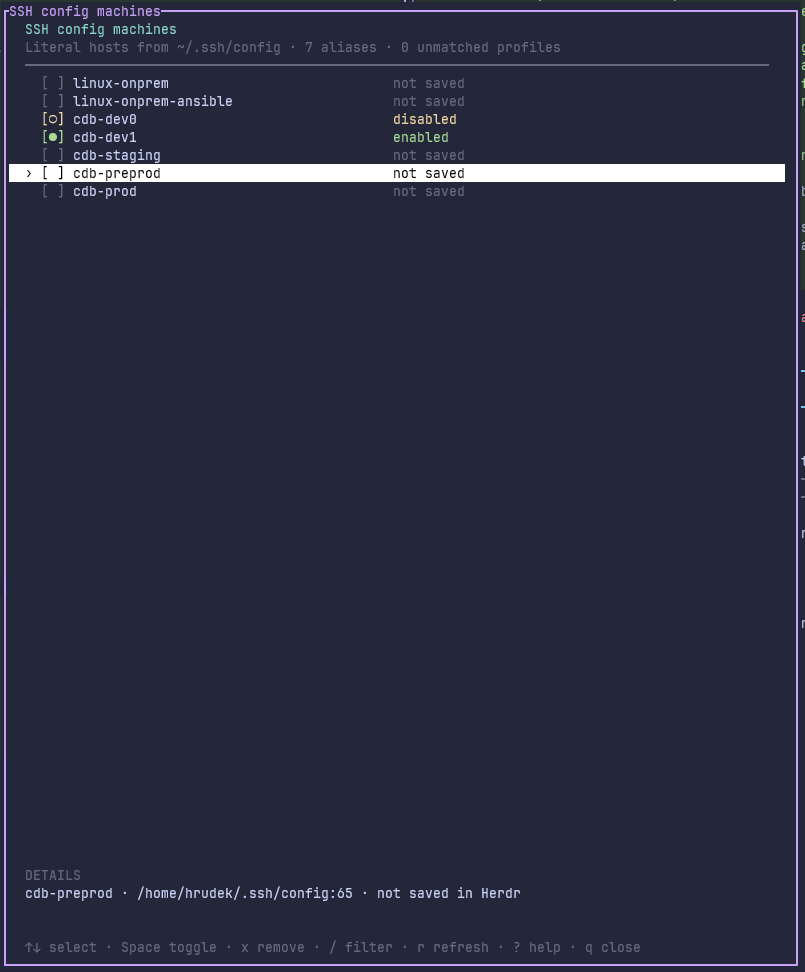

# Herdr SSH Config Dash

Manage Herdr machines from the hosts already defined in your `~/.ssh/config`.



The plugin lists your SSH host aliases and shows whether each one is saved and enabled in Herdr. You can add, disable, enable, or remove machines without entering the host details again.

## Installation

Requires Herdr 0.9.1 or newer.

```sh
herdr plugin install bearylabs/herdr-ssh-config-dash
```

Then open Herdr and run the global action **Manage SSH config machines** (`herdr-ssh-config-dash.manage`).

## Usage

- **Unchecked**: the host is not saved in Herdr. Press Space or Enter to add it.
- **Green dot**: the machine is enabled. Press Space or Enter to disable it.
- **Yellow dot**: the machine is disabled. Press Space or Enter to enable it.
- Press `x` to remove a machine from Herdr after confirmation.

Adding a machine starts Herdr's normal SSH setup. It may ask for authentication or permission to install or update the remote Herdr server.

Removing a machine only forgets its local Herdr profile. It does not stop remote sessions or agents.

### Controls

| Key | Action |
| --- | --- |
| `↑` / `↓` or `j` / `k` | Move through the list |
| Space or Enter | Add, disable, or enable the selected machine |
| `x` | Remove the selected machine |
| `/` | Filter hosts |
| `r` | Reload hosts and machine state |
| `?` | Show help |
| `q` or Ctrl-C | Close |

## SSH config support

The plugin reads literal `Host` aliases from `~/.ssh/config`, including aliases from `Include` files. Wildcards such as `Host *.example.com` are not shown.

Your SSH config is parsed without evaluating it, so commands such as `Match exec` are not run while opening the picker.

<details>
<summary>Hide hosts from the picker</summary>

Create a `config.json` in the directory shown by:

```sh
herdr plugin config-dir herdr-ssh-config-dash
```

Example:

```json
{
  "excludeHosts": ["personal-host", "lab-?", "*.private.example"]
}
```

The patterns are case-insensitive and support `*` and `?`.

</details>

## Supported platforms

Linux and macOS.

## License

[MIT](LICENSE)
